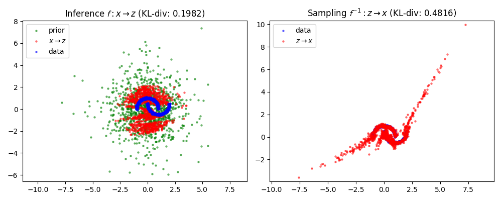
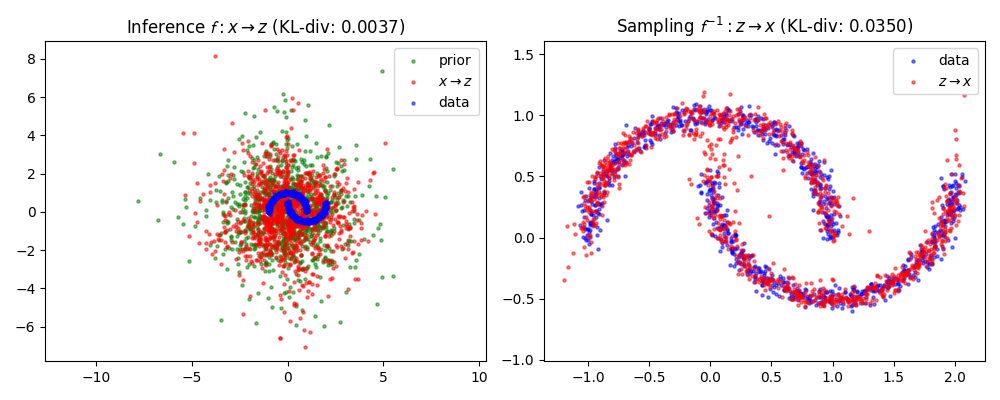

# Normalizing Flows in PyTorch

This repository contains implementations of Normalizing Flows in PyTorch.
The implementations are heavily inspired by [karpathy/pytorch-normalizing-flows](https://github.com/karpathy/pytorch-normalizing-flows).

## Getting Started

Run the following command to install the required dependencies:

```bash
uv sync
source .venv/bin/activate
```

## NICE [Dinh+ 2014]

Train the NICE model on the specified dataset for 10,000 steps by default:

```bash
python train_nice.py --dataset moons
```

### Moons Dataset



### Gaussian Mixture Dataset


## RealNVP [Dinh+ 2016]

Train the RealNVP model on the specified dataset for 10,000 steps by default:

```bash
python train_real_nvp.py --dataset moons
```

### Moons Dataset



### Gaussian Mixture Dataset


## References

- [karpathy/pytorch-normalizing-flows](https://github.com/karpathy/pytorch-normalizing-flows)
- [NICE: Non-linear Independent Components Estimation](https://arxiv.org/abs/1410.8516)
- [RealNVP: Improved Variational Inference with Inverted Autoregressive Flow](https://arxiv.org/abs/1605.08803)
